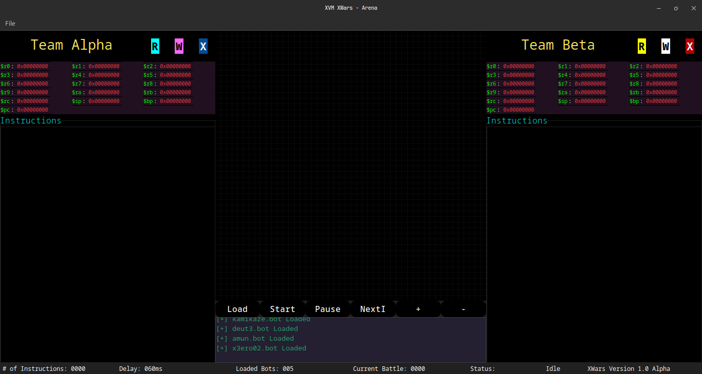
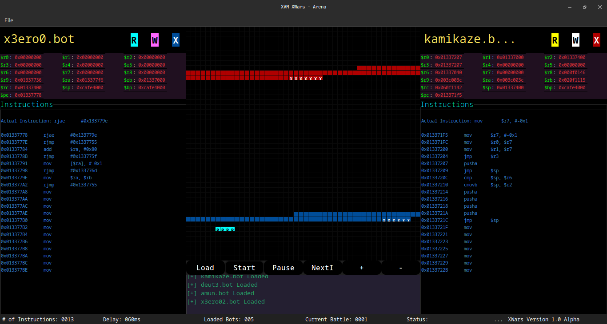
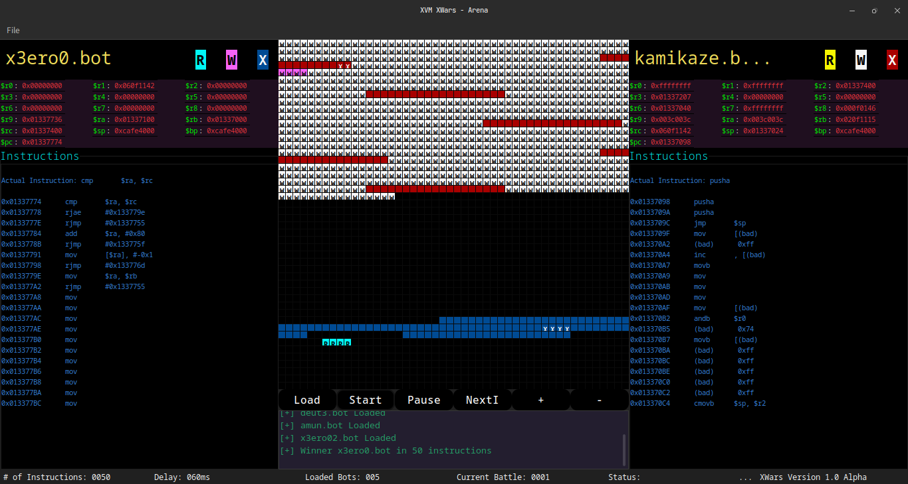
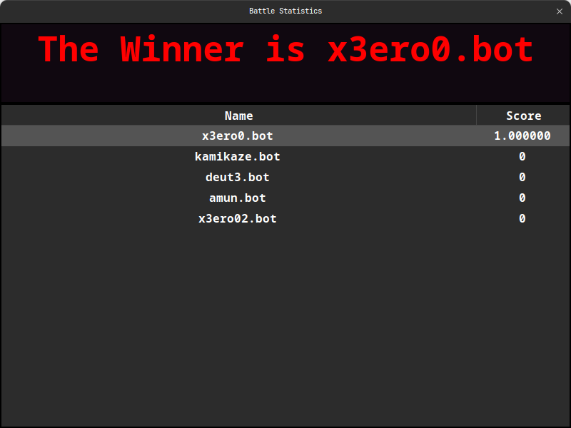

# XWars

R2Wars like bot fighting game written for xvm. You write your bots
in XVM assembly and they fight in a common memory grid. One who
kills the other bot, wins!

### Screenshots
  
  
  
  

### Build Instructions
- You first need a working setup of wxWidgets. Try installing it from your package manager.
  If package manager installation doesn't work then please try building it from source.
  We recommend building it from source.
- Download/Clone this repo and create a build directory in project root.
- Go to the build directory and launch a terminal there.
- Execute the following commands : 
  - `cmake ..`
  - `make -j8`
- To run xwars, you can directly run the executable, or you can use cmdline
  arguments to use special configs and specify where bots are present.
  - `xwars -h`

### Bot Writing Instructions
If bot size is greater than 0x180 your bot will be trimmed to 0x150
make sure your bot is smaller than 0x180 bytes
